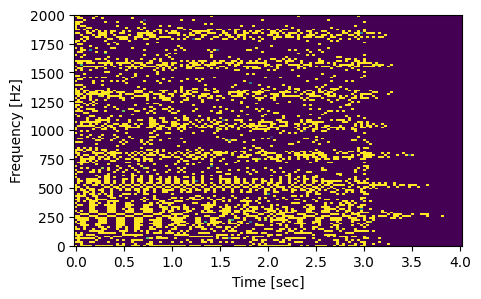
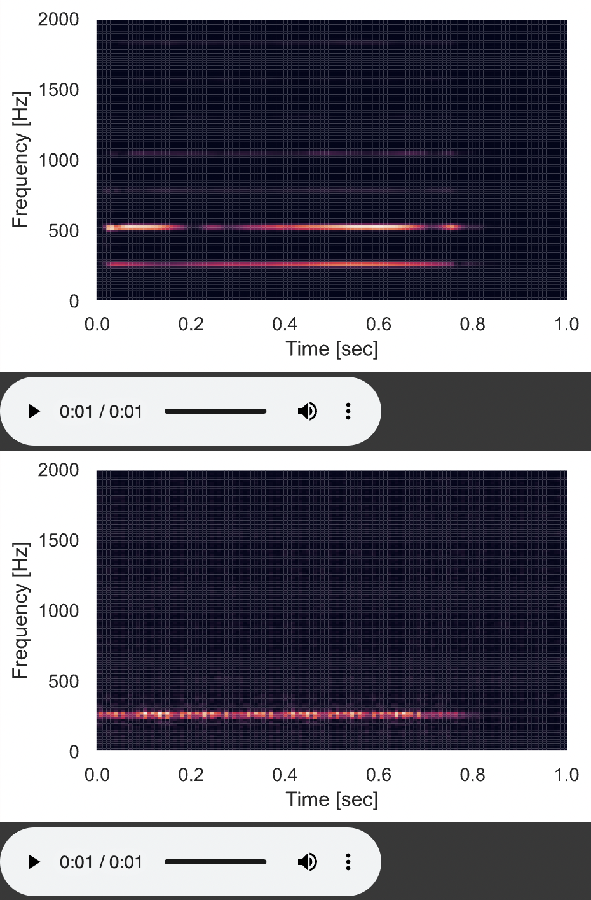
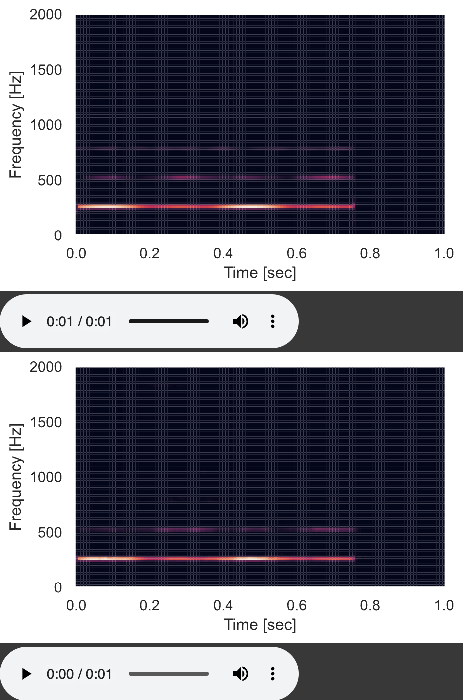

# Team HummingFace

**1. Project Title:** HummingFace: Generating Sounds with Deep Learning 

**2. Team members:** Léo Dupire and Mateus Aragão @aragaomateus

**3. Goal/Objective:**

Turn a acapellas sound or lead vocal audio of a music into a synthesized piano melody.

**4. Challenges:**

- Dealing with audio data
- Repurposing image generation models
- Working with GANs & Deep AutoEncoders
- Hardware constraints & training models in VMs.

**5. Approach/Techniques:**

- Pre-processing: We will convert the raw audio into spectrograms using short-time Fourrier transforms. This reduces the number of datapoints, increases the capture of contextual dependency, and is computationally lighter to handle than raw audio.
    
    [https://lh3.googleusercontent.com/BUCz47spC2rnMEh-rv6dVEDJj4doKV5OaMD-MkuY8VOTqesgf3ydEke4Em30G-ZjyvAG6Q72Cm0QmVH01-O9g2hQ9IfFSLPCOFgJj-L6vegutTw1L4YRMDGDA3RFux1d--PyjsBxHd11doYDXuAgR44zUF7Nf5QcAwkk8MKxpwvXNx82kYXOMRTzN5KKog](https://lh3.googleusercontent.com/BUCz47spC2rnMEh-rv6dVEDJj4doKV5OaMD-MkuY8VOTqesgf3ydEke4Em30G-ZjyvAG6Q72Cm0QmVH01-O9g2hQ9IfFSLPCOFgJj-L6vegutTw1L4YRMDGDA3RFux1d--PyjsBxHd11doYDXuAgR44zUF7Nf5QcAwkk8MKxpwvXNx82kYXOMRTzN5KKog)
    
- Output will be a series of spectrograms. In post-processing, these will be converted into audio files using inverse short-time Fourrier transforms.
- Use a Convolutional Neural Network
    - The loss will be determined by the similarity between
    - Potential use Generative Adverserial Networks (GAN) instead
- Image classification models for analyzing spectrograms of the sounds
- If simplification is needed, we will narrow down the scope of the learning. We will focus on specific music genres (rock, techno, opera, etc.), allowing the model to perform better on a smaller task. This approach is more about depth rather than breadth.

**6. Implementation details: hardware (type of compute GPU/TPU etc, cloud based, edge devices), software (framework, existing code to reuse), dataset.**
- Google GCP, Vertex AI.
- Google Collab Running on Local GPU
- Inspired on existing projects with code such as MuseGAN:
    - [https://github.com/salu133445/musegan](https://github.com/salu133445/musegan)
- Available dataset to use:
    - [https://salu133445.github.io/lakh-pianoroll-dataset/](https://salu133445.github.io/lakh-pianoroll-dataset/)
    - **NSynth: [https://paperswithcode.com/dataset/nsynth](https://paperswithcode.com/dataset/nsynth)**
    - MuseData: [https://paperswithcode.com/dataset/musedata](https://paperswithcode.com/dataset/musedata)

**7. Demos:**

- Autoencoder with 64 Latent Space, trained in 2 epochs.
    - Top image is Real spectogram
    - Bottom image is Generated spectogram

-  Autoencoder 120 Latent Space,trained in 20 epochs.
    - Top image is Real spectogram
    - Bottom image is Generated spectogram

**8. References (if any):**
    - Dataset Used: 
     - **NSynth: [https://paperswithcode.com/dataset/nsynth](https://paperswithcode.com/dataset/nsynth)**

    - Blog Posts:
    - Deep AutoEncoder Tutorial In Pytorch
    C-Gans Tutorial in Keras/Tensorflow
    - Important Papers: 
    Conditional Generative Adversarial Nets[Mirza el atl 2014]
    Reducing the Dimensionality of Data with Neural Networks[Hinton et al 2006

    - Sequential Decision-Making in Musical Intelligence.
    - Artificial Intelligence in Music, Sound, Art and Design. 11th International Conference, EvoMUSART 2022, Held as Part of EvoStar 2022, Madrid, Spain, April 20–22, 2022, Proceedings
    - MuseGAN: Multi-track Sequential Generative Adversarial Networks for Symbolic Music Generation and Accompaniment.[https://arxiv.org/pdf/1709.06298v2.pdf](https://arxiv.org/pdf/1709.06298v2.pdf)
        - [https://github.com/salu133445/musegan](https://github.com/salu133445/musegan)
        - https://salu133445.github.io/lakh-pianoroll-dataset/
    - [https://ai.googleblog.com/2018/09/googles-next-generation-music.html](https://ai.googleblog.com/2018/09/googles-next-generation-music.html)
    - https://google-research.github.io/seanet/audiolm/examples/

