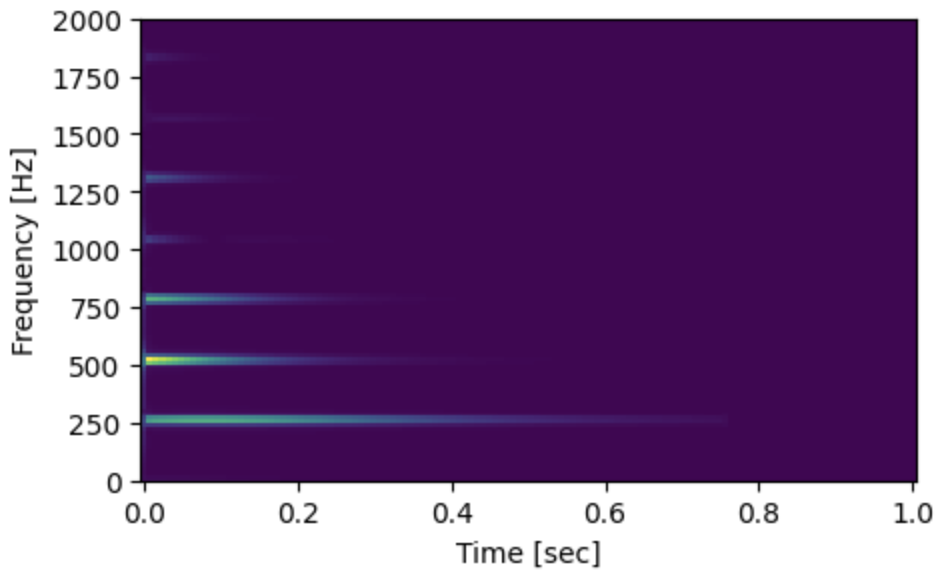
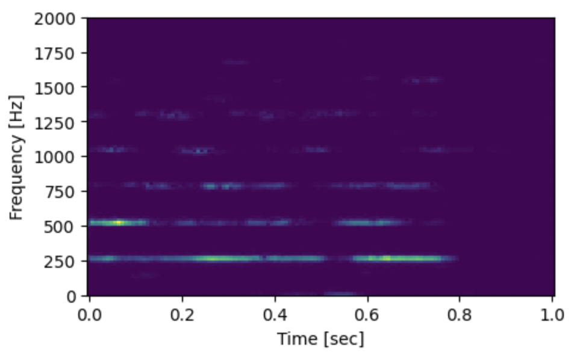
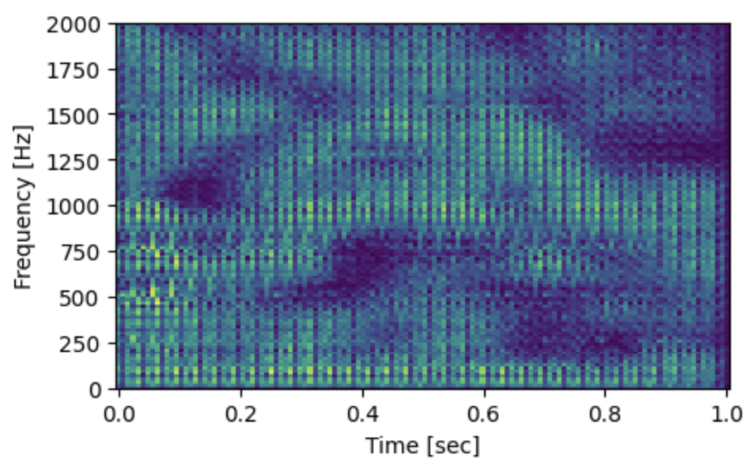

# Team HummingFace

## 1. Project Title: ___HummingFace: Sound Generation with Deep Learning___

## 2. Team members: Léo Dupire & Mateus Aragão

__GitHub Accounts:__ @leodup, @aragaomateus

## 3. Goal/Objective:

Generate original sounds using the [NSynth Dataset](https://magenta.tensorflow.org/datasets/nsynth). These can be used for music production, revealing novel sounds for inspiration, sampling, and/or composition. We started with generating random sounds and eventually would like to generat sounds from a set of desired characteristics (pitch, distortion, reverb, etc.). 

## 4. Challenges:

- Dealing with audio data
- Repurposing image generation model architectures
- Working with GANs, Conditional GANs & Deep AutoEncoders
- Hardware constraints & training models in Virtual Machines as well as utilizing local resources.

## 5. Approach/Techniques:

- Pre-processing: We converted the raw audio into spectrograms using short-time Fourrier transforms. This reduces the number of datapoints, increases the capture of contextual dependency, and is computationally lighter to handle than raw audio. An example of such a spectrogram, for a single note, is shown below.
    

    
- Output are a series of spectrograms. In post-processing, these will be converted back into audio using inverse short-time Fourrier transforms.

- We will use two main model architectues to generate the audio:
    - Conditional Generative Adverserial Networks (GAN): `HummingFace_Conditional_GANs.ipynb`. This model uses Binary Cross Entropy loss.

    - Deep Autoencoders, using its decoder as the generator: `HummingFace_Autoencoder.ipynb`. Both the encoder and decoder use MSE loss.
    
    - (We also made a regular GAN): `HummingFace_GAN.ipynb`. This model also uses Binary Cross Entropy loss.

- To make the task easier for the model, we narrowed down the scope of the learning to a single note/pitch for the Autoencoder. This allowed the model to perform better by better understanding the relationship between fundamental frequencies and their harmonics.

## 6. Implementation details: hardware (type of compute GPU/TPU etc, cloud based, edge devices), software (framework, existing code to reuse), dataset.

- Google GCP, Vertex AI on NVIDIA Tesla P100.

- Ultimately, the Deep Autoencoder was run locally. Configuring torch to run on the M1 chip which accelerated learning (surpassing what was available otherwise) on Google Collab.

- We used TensorFlow for the GAN models and PyTorch for the Autoencoder. There was no particular reason for the difference in framework between the two models.

- Inspired on existing projects with code such as:
    - [MuseGAN](https://github.com/salu133445/musegan)
    - [Deep Autoencoders](https://uvadlc-notebooks.readthedocs.io/en/latest/tutorial_notebooks/tutorial9/AE_CIFAR10.html)

- The following dataset was used:
    - **NSynth: [https://paperswithcode.com/dataset/nsynth](https://paperswithcode.com/dataset/nsynth)**

## 7. Demos:

Despite having decent loss levels (generator: 1.3133, discriminator: 0.3324), the GAN did not perform well, as can be heard in the following sound comparisons:

- For reference, this is what an expected sound sounds like: [Expected Audio Example (from dataset)](./AudioDemos/expected.wav)

- This is what the Conditional Gan produced: [GAN Audio](./AudioDemos/GAN.wav)

The Autoencoder performed much better. We visually show the learning process below.

We experimented on several latent dimensionalities, observing that the loss decreased with the higher latent dimensions.

Below, we first show the original sound and its spectrogram (to be replicated), followed by the reconstructed sound. This is with a latent space of dimension 32.

- [Desired Audio](./AudioDemos/original_sound_16L.wav)

- [Autoencoder Audio](./AudioDemos/generated_120L_20E.wav)

Here is another iteration, this time using a latent space of dimension 128.

- [Desired Audio](./AudioDemos/128_1.wav)

- [Autoencoder Audio](./AudioDemos/128_2.wav)

Finally, here is a generated sample using a random latent space input and running it straight from the decoder (dropping the encoder). This was done with only 16 latent variables! Thats a compression taking up only $\frac{16}{2*128*128} \approx 0.049\%$ of the original size.

- [Original Decoder Audio](./AudioDemos/original_sound_16L.wav)

It is no surpise the Autoencoder was a good choice for this task. As can be seen in the spectrograms, we are essentially dealing with a 1D array that has been extruded into a 2D matrix. The encoder, acting as a feature extractor, quickly identifies these lines. In fact, in just one epoch, it was able to replicate the fundamental note it was trained on (as seen in the learning progress image, previously). With further training it started generating harmonics as well. 

We can see these harmonics appear by inputting pure (near-zero) noise in the latent space for the decoder at 20 epochs and 100 epochs. This leads to the following spectrograms:

- 20 Epochs:

- 100 Epochs:

On top of this, the Autoencoder registers attack and release, as well as some vibrato (it does not perform well on high frequency vibrato, however). This is reflected in the fluctuating intensities of the lines in the reconstructed spectrograms from earlier.

## 8. References (if any):

- Dataset Used: 
    - **NSynth: [https://paperswithcode.com/dataset/nsynth](https://paperswithcode.com/dataset/nsynth)**

- Code resources:
    - [MuseGAN](https://github.com/salu133445/musegan)
    - [Deep Autoencoders](https://uvadlc-notebooks.readthedocs.io/en/latest/tutorial_notebooks/tutorial9/AE_CIFAR10.html)

- Artificial Intelligence in Music, Sound, Art and Design. 11th International Conference, EvoMUSART 2022, Held as Part of EvoStar 2022, Madrid, Spain, April 20–22, 2022, Proceedings
- MuseGAN: Multi-track Sequential Generative Adversarial Networks for Symbolic Music Generation and Accompaniment.[https://arxiv.org/pdf/1709.06298v2.pdf](https://arxiv.org/pdf/1709.06298v2.pdf)

    - [https://github.com/salu133445/musegan](https://github.com/salu133445/musegan)
    - https://salu133445.github.io/lakh-pianoroll-dataset/

- [https://ai.googleblog.com/2018/09/googles-next-generation-music.html](https://ai.googleblog.com/2018/09/googles-next-generation-music.html)

- https://google-research.github.io/seanet/audiolm/examples/

